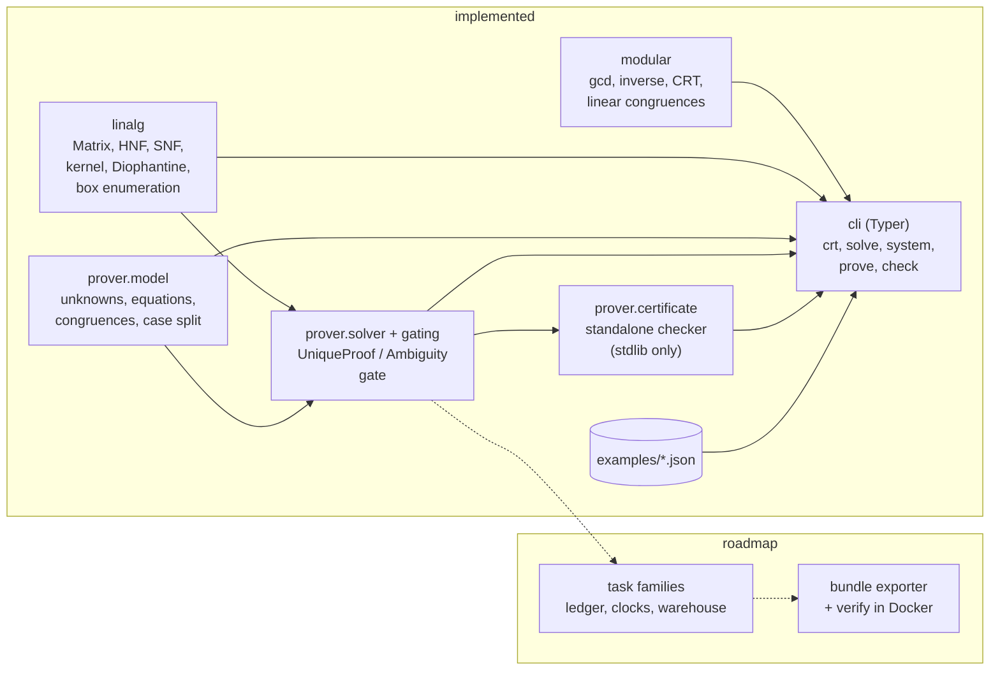

# TrapForge

[](https://github.com/vipul21435/trapforge/actions/workflows/ci.yml)

**Author verifiable, adversarial data tasks for AI agents - and prove they have exactly one right answer.**

Most "hard" data tasks for agents are hard for the wrong reason: the instructions are
ambiguous, several answers are defensible, and the grader quietly rewards whichever one the
author happened to pick. TrapForge is being built to take the opposite approach: every task
ships with a machine-checked argument that its data admits exactly one interpretation. The
target pipeline is a synthetic corpus with hidden integer structure, an exact constraint
system built from what the corpus reveals, a uniqueness proof (or a concrete counterexample
pair of hidden worlds), a reference solver, a naive baseline that fails on hidden deciding
cases, and a byte-exact pytest grader.

**What exists today** is the exact math that pipeline stands on and the uniqueness prover
built on it: a constraint model, an exact solver that returns a unique world or a concrete
counterexample pair, JSON certificates with a standalone checker, a gate that extends a
sample until the proof holds, and a CLI over all of it. Everything is pure Python 3.12
integers (no floats, no numpy), implemented from scratch and property-tested against brute
force and `sympy` (a dev-only oracle). The task families and the bundle exporter are on the
[Roadmap](#roadmap).

## Why this exists

This project generalizes the kind of work I do building benchmark tasks for AI coding agents
at an AI-data company: reproducible environments, reference solutions that really compute the
answer, byte-exact graders, and synthetic datasets that are provably unambiguous. All task
designs, examples and data here are original.

## Features (implemented and tested)

| Area | Module | What it gives you |
| --- | --- | --- |
| Modular arithmetic | `trapforge.modular` | extended gcd, modular inverse with typed errors, CRT for **non-coprime** moduli, full solution sets of `a*x = b (mod m)` and of mixed-moduli systems, and re-checkable inconsistency proofs |
| Integer linear algebra | `trapforge.linalg` | immutable `Matrix` with Bareiss determinant and rank, Hermite and Smith normal forms with unimodular transforms, saturated integer kernels, `solve_diophantine` returning an `AffineLattice` or an `UnsolvableSystem` certificate, exact lexicographic enumeration of lattice points in a box |
| Prover constraint model | `trapforge.prover` | bounded integer unknowns, linear equations, linear congruences and a finite case split over discrete choices (for example an unknown counter period), with validation, case instantiation, violation reports and a JSON round trip |
| Uniqueness prover | `trapforge.prover.prove` | reduces every case to one Diophantine system (one slack per congruence), solves it with `solve_diophantine`, enumerates the lattice inside the box, and returns `UniqueProof`, `Ambiguity` (counterexample pair plus the exact size of the ambiguity space, or a capped lower bound) or `Infeasible` |
| Certificates | `trapforge.prover.check_certificate` | canonical JSON certificate per verdict; a standalone checker (standard library only) re-verifies it without the solver: lattice point, kernel basis, integer right inverse and a nonsingular rank minor per solvable case, integer Fredholm weights per unsolvable case |
| Uniqueness gate | `trapforge.prover.gate` | extends a generated sample with further observations, lazily, until exactly one world fits; stops at the shortest prefix, records the ambiguity size after each step, and raises on a planted world that breaks the sample |
| CLI | `trapforge` | `crt`, `solve`, `system`, `prove` and `check` commands over the layers above, plus `info` |
| Container | `Dockerfile` | multi-stage uv build on `python:3.12-slim` pinned by digest, non-root user, `LABEL project=trapforge` |
| Demo | `make demo` | `scripts/demo.sh` runs the CLI over the bundled `examples/` inputs, locally or in the image |

Every "no solution" answer comes with a certificate that can be re-checked without trusting
the solver: a conflicting pair of congruences and a witness modulus, or integer weights `w`
and a modulus `d` such that `d` divides every entry of `w A` but not `w . b`.

## Quickstart

Requires [uv](https://docs.astral.sh/uv/) and make. No GPU, no API keys, no network at run time.

```bash
git clone https://github.com/vipul21435/trapforge.git
cd trapforge
uv sync        # locked runtime + dev dependencies
make check     # ruff, mypy --strict, pytest with the 85% branch-coverage gate
make demo      # the CLI end to end on examples/
```

These five commands were run in a fresh clone: `make check` reported 330 passed at 100%
branch coverage, and the whole sequence (clone, sync, check, demo) took 39 s wall time on an
Apple-silicon laptop. With Docker, `make docker-demo` builds the image and runs the same demo
inside it.

## CLI usage

The command list from `trapforge --help` (Typer draws it in a box; the frame is dropped here):

```text
Usage: trapforge [OPTIONS] COMMAND [ARGS]...
Commands:
  info    Print the package version and the Python it runs on.
  crt     Combine congruences with any moduli (coprime or not) into one residue class.
  solve   Solve an integer system A x = b exactly and list its solutions inside a box.
  system  Validate and print a constraint system; optionally test a candidate assignment.
  prove   Decide how many hidden worlds fit a constraint system, with a re-checked certificate.
  check   Re-check a uniqueness certificate from scratch, without running the solver.
```

Exit code 0 means the input was valid (with or without a solution); 1 means a check failed
(`check` on a certificate that does not hold, `prove --require-unique` on a sample that is
not unique); 2 means the input could not be read or parsed. The outputs below are copied from `make demo`.

**`crt`** combines congruences whose moduli share factors, or proves they conflict:

```text
$ trapforge crt 5:12 5:18
#0: x = 5 (mod 12)
#1: x = 5 (mod 18)
combined: x = 5 (mod 36)

$ trapforge crt 1:4 2:6
#0: x = 1 (mod 4)
#1: x = 2 (mod 6)
no solution: congruences #0 and #1 are incompatible: #0 forces x = 1 (mod 2) but #1 forces x = 0 (mod 2)
certificate re-checked: True
```

**`solve`** reads `{"matrix", "rhs", "lower", "upper"}` from JSON, prints the whole integer
solution lattice and the points inside the box, and says whether the box pins down one point:

```text
$ trapforge solve examples/checksums.json
system: 2 equations, 3 unknowns
integer solutions: x = (4, 2, 7) + t0*(290, -699, 67), t in Z^1
  (4, 2, 7)
box (0, 0, 0)..(9, 9, 9): exactly one point in the box (unique)

$ trapforge solve examples/checksums-ambiguous.json --limit 3
system: 1 equation, 3 unknowns
integer solutions: x = (0, 0, 13) + t0*(1, 0, -1) + t1*(0, 1, -1), t in Z^2
  (0, 4, 9)
  (0, 5, 8)
  (0, 6, 7)
box (0, 0, 0)..(9, 9, 9): more than 3 points in the box (ambiguous)

$ trapforge solve examples/parity.json
system: 2 equations, 2 unknowns
no integer solution: weighting the equations by (0, 1) makes every coefficient a multiple of 2, but the right-hand side becomes 1, which is not
certificate re-checked: True
```

**`system`** loads a constraint system in the prover's JSON format and tests candidate
hidden worlds against it. The bundled ledger example is the trap the planned affine-ledger
family is built around: with a composite modulus, two different affine maps fit every anchor.

```text
$ trapforge system examples/ledger-anchors.json --check a=5 --check b=7
unknowns: 1 <= a <= 11, 0 <= b <= 11
anchor x=1: a + b = 0 (mod 12)
anchor x=3: 3*a + b = 10 (mod 12)
2 unknowns, 2 constraints, 1 case
a=5, b=7 satisfies every constraint

$ trapforge system examples/ledger-anchors.json --check a=11 --check b=1
...
a=11, b=1 satisfies every constraint

$ trapforge system examples/wrapping-clock.json --check P=18 --check T=41 --check w=2
choices: P in {12, 18}
unknowns: 0 <= T <= 100, 0 <= w <= 8
beacon: T - P*w = 5
sync: T = 5 (mod 36)
2 unknowns, 2 constraints, 2 cases
P=18, T=41, w=2 satisfies every constraint
```

**`prove`** decides how many hidden worlds fit, prints a counterexample pair when there is
more than one, and re-checks its own certificate with the standalone checker. `--certificate
FILE` writes the certificate as canonical JSON; `--require-unique` turns "not unique" into
exit code 1 for scripted gating.

```text
$ trapforge prove examples/ledger-anchors.json
system: 2 unknowns, 2 constraints, 1 case
ambiguous: exactly 2 worlds fit, for example a=5, b=7 and a=11, b=1 (they differ in a, b)
certificate re-checked: True (verified: ambiguous, 2 solutions)

$ trapforge prove examples/ledger-anchors-unique.json
system: 2 unknowns, 3 constraints, 1 case
unique: a=5, b=7
certificate re-checked: True (verified: unique, 1 solution)

$ trapforge prove examples/wrapping-clock.json
system: 2 unknowns, 2 constraints, 2 cases
ambiguous: exactly 6 worlds fit, for example P=12, T=5, w=0 and P=12, T=41, w=3 (they differ in T, w)
certificate re-checked: True (verified: ambiguous, 6 solutions)
```

**`check`** re-verifies a certificate using only the checker (exit 1 if it does not hold).
`examples/ledger-anchors-unique.cert.json` is the certificate `prove --certificate` writes for
the unique ledger; a test regenerates it and compares the bytes.

```text
$ trapforge check examples/ledger-anchors-unique.cert.json
verified: unique, 1 solution
```

The lattice evidence in that certificate (an excerpt, indentation trimmed):

```text
"basis": [
  [12, 0, 1, 3, 2],
  [0, 12, 1, 1, 1]
],
"evidence": "lattice",
"minor": {
  "columns": [0, 1, 2],
  "rows": [0, 1, 2]
},
"point": [5, 7, 1, 1, 1],
```

The columns are `(a, b, s1, s2, s3)`, one slack per congruence. The basis moves `a` and `b`
only in steps of 12, so the box `1 <= a <= 11, 0 <= b <= 11` holds the single point
`a=5, b=7`; the rank-3 minor shows there are no further kernel directions.

## Library usage

```python
from trapforge.modular import Congruence, LinearCongruence, crt, solve_linear_system

# Two counters that wrap at 12 and 18 both read 5: when can that happen?
print(crt([Congruence(5, 12), Congruence(5, 18)]))

# An affine scramble 6*x + 4 (mod 10) produced 0. Which x mod 10 are possible?
scramble = LinearCongruence(6, -4, 10)
print(list(scramble.solve().residues_mod(10)))

# One more fact (x is odd) pins x down; a contradicting fact yields a checkable proof.
print(solve_linear_system([scramble, Congruence(1, 2)]))
system = [scramble, Congruence(2, 10)]
proof = solve_linear_system(system)
print(proof)
print(proof.verify(system))
```

```text
x = 5 (mod 36)
[1, 6]
x = 1 (mod 10)
congruences #0 and #1 are incompatible: #0 forces x = 1 (mod 5) but #1 forces x = 2 (mod 5)
True
```

```python
from trapforge.linalg import Matrix, smith_normal_form, solve_diophantine

# Three hidden digits, observed only through two weighted checksums.
A = Matrix.of([[1, 10, 100], [7, 3, 1]])
solutions = solve_diophantine(A, [724, 41])
print(solutions)
print(list(solutions.points_in_box((0, 0, 0), (9, 9, 9))))

# Smith normal form with both transforms: U @ C @ V == S.
C = Matrix.of([[2, 4, 4], [-6, 6, 12], [10, -4, -16]])
form = smith_normal_form(C)
print(form.invariant_factors, form.U @ C @ form.V == form.S)
```

```text
x = (4, 2, 7) + t0*(290, -699, 67), t in Z^1
[(4, 2, 7)]
(2, 6, 12) True
```

```python
from trapforge.prover import ConstraintSystem, Congruent, gate, prove


def anchor(x: int, y: int) -> Congruent:
    """The ledger shows that record x was scrambled to y under x -> (a*x + b) mod 12."""
    return Congruent.of({"a": x, "b": 1}, y, 12, f"anchor x={x}")


sample = ConstraintSystem.build({"a": (1, 11), "b": (0, 11)}, [anchor(1, 0), anchor(3, 10)])
proof = prove(sample)
print(proof)
print(proof.check().reason)

# Reveal more records only until the planted map (a, b) = (5, 7) is the only one left.
result = gate(sample, [anchor(7, 6), anchor(2, 5), anchor(4, 3)], hidden={"a": 5, "b": 7})
print(result)
print([constraint.label for constraint in result.added])
```

```text
ambiguous: exactly 2 worlds fit, for example a=5, b=7 and a=11, b=1 (they differ in a, b)
verified: ambiguous, 2 solutions
passed after 2 more constraints (sizes 2, 2, 1): unique: a=5, b=7
['anchor x=7', 'anchor x=2']
```

The anchor at `x=7` reads 6 under both maps, so it does not help; the gate keeps it (the
sample is a prefix of the stream) and stops after `x=2`, which separates them.

All outputs above come from running the snippets with `uv run python`; the module docstrings
carry more examples, and `tests/test_doctests.py` runs all of them so they cannot drift.

## Architecture



```
src/trapforge/
  modular.py            number theory over Python int
  linalg/               matrix.py, hermite.py, smith.py, lattice.py, diophantine.py
  prover/model.py       the constraint model the uniqueness prover reasons about
  prover/solver.py      exact per-case solver, verdicts and certificate writer
  prover/certificate.py standalone certificate checker (standard library only)
  prover/gating.py      the uniqueness gate
  cli.py                Typer CLI
examples/               bundled JSON inputs for the CLI and the demo
scripts/demo.sh         the end-to-end demo, runnable locally or in the image
```

## Measured numbers

Every number here comes from a command in this repo, run on the current tree.

| Number | Value | Command |
| --- | --- | --- |
| Tests | 330 passed (39 CLI, 1 demo script, 9 doctest modules, 76 linalg, 89 modular, 116 prover: 41 model, 22 solver, 45 certificate, 8 gate) | `make cov` and `uv run pytest -q --co` |
| Tampered certificates rejected | 40 hand-written tamperings, each with its expected reason | `uv run pytest -q tests/test_prover_certificate.py -k tampered` |
| Branch coverage of `src/` | 100% (1481 statements, 476 branches); CI fails under 85% | `make cov` |
| Demo wall time | 1.1 s for all 13 steps | `time make demo` |
| Image size | 47.7 MB content size (223 MB unpacked on disk) | `make docker-build && docker images trapforge` |
| Source and test size | 3106 lines in `src/`, 2819 lines in `tests/` | `git ls-files src \| xargs wc -l`, same for `tests` |

The property tests use Hypothesis against brute force on small inputs and against `sympy`
on large ones (moduli up to 10^30, 30-digit planted solutions, dense 10x10 matrices), and
tampered certificates must always be rejected. The prover is checked against brute force on
random small systems (exact and capped counts, witnesses, certificates), and a soundness
property perturbs one integer of a certificate at random: whenever the checker still accepts,
its verdict and count must be the truth. CI runs a derandomized profile
(`HYPOTHESIS_PROFILE=ci`) so any failure reproduces.

## Design decisions

- **Exact integers only.** Every value is a Python `int`; `Matrix.of` rejects floats and
  Fractions. A silently truncated 2.5 would break a uniqueness proof.
- **Proofs instead of "no".** Inconsistent systems return certificate objects with a
  `verify` method that re-checks them with a gcd or one vector-matrix product, never by
  re-solving. The CLI prints the re-check next to every certificate.
- **Certificates that are cheaper to check than to find.** A uniqueness certificate never
  asks the checker to run Smith or Hermite forms: it re-checks `M p = r`, `M K^T = 0`,
  `K W = I` for a supplied right inverse `W`, one nonzero determinant for the rank, and then
  walks the box. The checker imports only the standard library so it can be vendored or
  audited on its own.
- **Counterexamples, not just "not unique".** An ambiguous sample returns the first two
  worlds that fit (in case order, then lexicographic order) and the size of the ambiguity
  space (exact up to a cap), which is what a task author needs to decide which record to
  reveal next.
- **Canonical solution sets.** An `AffineLattice` keeps its kernel basis in Hermite normal
  form and its point reduced modulo it, so equal sets compare equal and box enumeration is
  exact, lazy and lexicographic.
- **SNF on top of HNF.** `smith_normal_form` diagonalizes the Hermite form of `A` rather than
  `A`; on one seeded dense 10x10 matrix this cut the largest entry of `V` from 539 digits to
  31, and a regression test bounds transform size.
- **sympy is a test oracle, not a dependency.** The runtime depends only on Typer, so a
  future exported reference solver can vendor the math modules into a bare
  `python:3.12-slim` image.
- **Reproducible builds.** `uv.lock` is enforced with `uv sync --locked` in CI and in the
  Dockerfile, and both base images are pinned by digest.

The full decision log lives in [PLAN.md](PLAN.md).

## Roadmap

Built in the slices listed in [PLAN.md](PLAN.md). Slices 1-3 are done; slice 8 is partly
done (the CLI image and `make demo`).

- **Slice 4: plugin API and the affine-scrambled ledger family** (the trap shown by
  `examples/ledger-anchors.json`), with a reference solver and a naive baseline.
- **Slice 5: multi-clock log merge family** (wrapping counters with unknown periods, CRT with
  non-coprime moduli).
- **Slice 6: warehouse conservation family** (a hidden transfer matrix behind aggregates).
- **Slice 7: bundle exporter and `trapforge verify`** (instruction, data, digest-pinned
  Dockerfile, standalone reference solution, byte-exact grader; reference passes and baseline
  fails, locally and in Docker).
- **Slice 8: compose pipeline** that forges and verifies one bundle per family.
- **Slice 9: difficulty report and benchmarks** (baseline failure rates, ambiguity-space
  size, generation and proof latency) and authoring docs.

## License

MIT - see [LICENSE](LICENSE).
